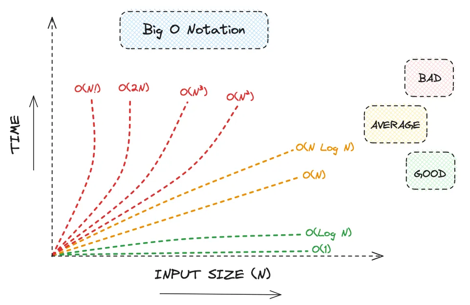
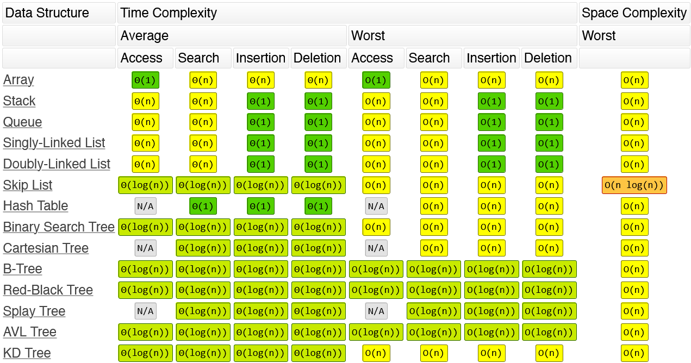

# 알고리즘 성능 분석
알고리즘 성능은
1. 시간 복잡도: 얼마나 빠른가?
2. 공간 복잡도: 얼마나 메모리를 적게 사용하는가?

두 가지로 평가할 수 있는데, 대부분의 경우 시간 복잡도를 평가한다.

## 시간 복잡도
### 왜 시간 복잡도가 더 중요한가?
과거에는 메모리가 비싸고, 모자라서 공간 복잡도가 중요했다. 현재는 메모리가 저렴하기 때문에 시간 복잡도가 중요하다.

지금도 임베디드, 펌웨어 같이 한정된 메모리를 사용하는 프로그램은 공간 복잡도가 중요하다.

### 시간 복잡도 평가 방법
시간 복잡도 평가 방법은
1. 실제 실행 시간을 분석
2. 연산의 횟수를 분석

하는 방법이 있다.

보통 연산의 횟수를 분석한다.

동일한 코드여도 하드웨어의 성능에 따라 실행 시간이 달라지기도 하고,

동일한 하드웨어를 사용해도, 상황에 따라 실행 시간이 달라지기 때문이다.

### 연산 횟수를 세는 방법
#### 정석적인 방법
코드의 모든 연산의 횟수를 세고, 최고차항만 남긴다.
> 예시
> 
> 순차 탐색의 경우
> ```javascript
> for(let i = 0; i < arr.length; i++){
>   if(arr[i] === target)
>       return arr[i];
>   }
> return '데이터가 존재하지 않습니다.';
> ```
> 1. i < arr.length: 비교 연산 n번
> 2. i++: 증가 연산 n번
> 3. arr[i] === target: 비교 연산 n번
> 
> 연산 횟수의 합은 3n인데, 계수는 생략하기 때문에 연산 횟수는 n이다.

#### 단순화 한 방법
1. 가장 많이 발생하는 연산을 찾는다.
2. 상수를 제거한다.
3. 최고차항만 남긴다.

보통 핵심이 되는 연산의 횟수가 가장 많이 발생하는 연산이다.

예를들어 탐색의 경우 비교 연산, 정렬의 경우 데이터의 이동이 가장 많이 발생한다.

## 최악의 경우를 분석하는 이유
알고리즘 성능 분석은 보통 최악의 경우만 살펴본다.
1. 최악의 경우의 수행 시간은 수행 시간의 상한이다. 최악의 경우보다 오래 걸리는 경우는 존재하지 않는다.
2. 최악의 경우가 어떤 빈도로 발생하는 지 알 수 없다. 어떤 프로그램에서는 최악의 경우가 자주 발생한다.
3. 평균적인 경우의 수행 시간과 최악의 경우의 수행 시간이 거의 같은 경우가 있다.
4. 어떤 것이 평균적인 입력인지 알 수 없는 경우가 많다.

## 점근 표기법
점근 표기법은 충분히 큰 입력 크기에 대한 수행 시간 증가율을 따지기 때문에, 최고차항의 계수만 따진다.

### 표기법의 종류
O 표기(빅 오) : 함수의 상한을 나타내기 위해 사용. 함수의 기울기가 최고차항을 기준으로 특정 속도보다 빠르게 증가하지 않음을 나타낸다.

Ω 표기(빅 오메가) : 함수의 하한을 나타내기 위해 사용. 함수의 기울기가 최고차항을 기준으로 특정 속도보다 빠르게 증가함을 나타낸다.

Θ 표기(빅 세타) : 함수의 상한과 하한을 엄격하게 나타내기 위해 사용. 함수의 기울기가 최고차항을 기준으로 상한보다 느리게, 하한보다 빠르게 증가하는 것을 나타낸다.

## 빅 오
알고리즘의 성능 분석 시
1. 최선의 경우는 의미가 없는 경우가 많고,
2. 어떤 것이 평균적인 경우인지 판별하기 어렵다.

최악의 경우는 수행 시간의 상한이기 때문에, 빅 오를 주로 이용한다.

### 대표적인 빅 오의 기울기
기울기가 O(1)인 경우는 특수한 경우다.

기울기가 O(log n)인 알고리즘을 공부하는 것이 목표다.

기울기가 낮을 수록 구현 난이도가 높기 때문에 데이터의 수가 적을 경우 성능이 낮은 알고리즘을 사용하기도 한다.



### 정렬 알고리즘의 빅 오

| 정렬 알고리즘 | 공간 복잡도   | 시간 복잡도(최선의 경우) | 시간 복잡도(최악의 경우)    |
|---------|----------| -- |-------------------|
| 삽입 정렬   | O(1)     | O(n) | O(n <sup>2</sup>) |
| 선택 정렬   | O(1)     | O(n <sup>2</sup>)|     O(n <sup>2</sup>)              |
| 버블 정렬   | O(1)     | O(n)|       O(n <sup>2</sup>)            |
| 병합 정렬   | O(n)     |O(n log n) |      O(n log n)             |
| 퀵 정렬    | O(log n) |O(n log n)|  O(n <sup>2</sup>)                 |
| 힙 정렬    | O(1)     | O(n log n)|O(n log n)|

### 주요 자료구조의 빅 오

