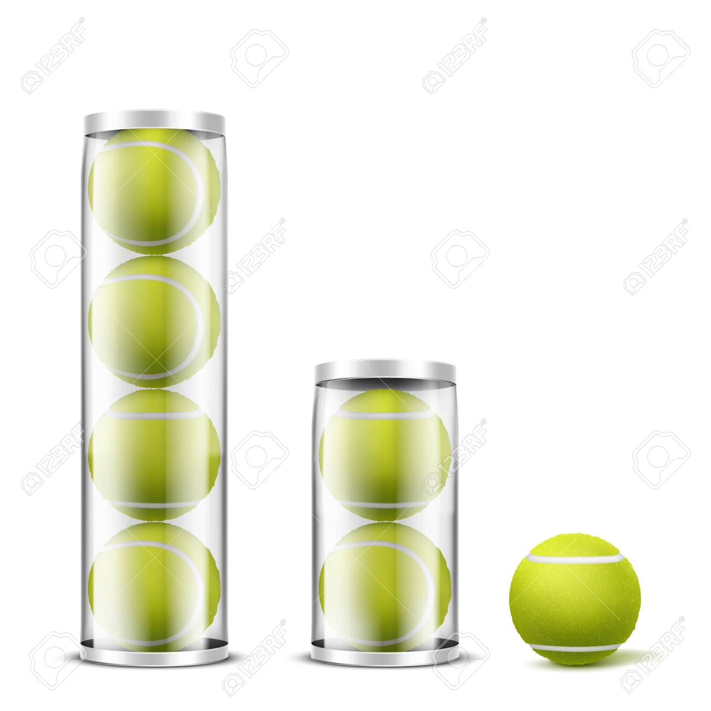

# 스택(Stack)

스택은 가장 마지막에 입력된 데이터가 가장 먼저 출력 되는 자료구조를 의미한다.
이것을 LIFO(Last In First Out) 혹은 후입선출 이라 한다.

현실에서의 예시는 테니스 공 캔을 들 수 있다.

컴퓨터 세계에서 볼 수 있는 예시는 웹 브라우저의 뒤로 가기를 들 수 있다.

## 자바스크립트에서 스택

자바스크립트의 배열은 동적 배열이고, 스택의 연산을 모두 지원하므로 따로 구현할 필요가 없다. 
배열의 push(), pop() 연산을 이용해 배열을 스택으로 사용할 수 있다.
